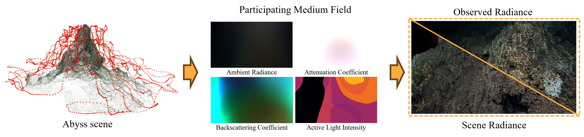

# AbyssSplat

**AbyssSplat: Active-Illumination-Aware Gaussian Splatting for Deep-Sea 3D Reconstruction**  
ACM Multimedia 2026 (accepted)

> Code release for the paper is being prepared. Paper and project-page links will be added after publication.

<p align="center">
  
</p>

AbyssSplat is a 3D Gaussian Splatting framework for reconstructing underwater scenes captured under complex deep-sea illumination. It explicitly models the non-uniform contribution of a co-axial active light source and uses medium-aware geometric confidence to prevent medium noise from driving unnecessary Gaussian densification.

## Highlights

- **Hybrid light-field attenuation model.** Separates ambient radiance, backscattering, attenuation, and active-light intensity, including inverse-square and two-way attenuation effects.
- **Medium-guided densification.** Modulates positional gradients with medium transmittance, opacity, and Gaussian scale to suppress low-confidence splits and clones.
- **Real-time rendering.** Built on [Nerfstudio](https://docs.nerf.studio/) and the [WaterSplatting](https://github.com/water-splatting/water-splatting) codebase.
- **General underwater reconstruction.** Supports both actively illuminated deep-sea scenes and shallow-water scenes with ambient illumination.

## Installation

AbyssSplat requires Python 3.8, CUDA 11.8, PyTorch 2.1.2, and Nerfstudio 1.1.4.

```bash
conda create -n abyss_splat python=3.8 -y
conda activate abyss_splat
python -m pip install --upgrade pip

# PyTorch and CUDA toolkit
pip install torch==2.1.2+cu118 torchvision==0.16.2+cu118 \
  --extra-index-url https://download.pytorch.org/whl/cu118
conda install -c "nvidia/label/cuda-11.8.0" cuda-toolkit

# tiny-cuda-nn and Nerfstudio
pip install ninja git+https://github.com/NVlabs/tiny-cuda-nn/#subdirectory=bindings/torch
pip install nerfstudio==1.1.4
ns-install-cli

# AbyssSplat
git clone https://github.com/Adios-Cowboy/abysssplat.git
cd abyssssplat
pip install --no-use-pep517 -e .
```

To install without building the CUDA extension, set `BUILD_NO_CUDA=1`; rendering and training require CUDA.

## Data preparation

The input must be a COLMAP dataset with undistorted images and a sparse reconstruction. To match the WaterSplatting preprocessing protocol, undistort a SeaThru-NeRF scene with:

```bash
colmap image_undistorter \
  --image_path /path/to/SeaThruNeRF/IUI3-RedSea/images_wb \
  --input_path /path/to/SeaThruNeRF/IUI3-RedSea/colmap/sparse/0 \
  --output_path /path/to/undistorted/IUI3-RedSea \
  --output_type COLMAP
```

We do not redistribute third-party image data. Please obtain SeaThru-NeRF and any deep-sea data from their original providers and follow their respective licences.

## Training

For an undistorted COLMAP dataset:

```bash
ns-train abyssssplat \
  --vis viewer+wandb \
  colmap \
  --data /path/to/undistorted/IUI3-RedSea \
  --images-path images \
  --colmap-path sparse \
  --downscale-factor 1
```

For the original SeaThru-NeRF layout, use `--images-path Images_wb` and `--colmap-path sparse/0`.

Training runs for 15,000 iterations by default. Outputs are saved under `outputs/<experiment>/abysssplat/<timestamp>/`.

## Evaluation and rendering

```bash
# Evaluate a checkpoint
ns-eval \
  --load-config outputs/<experiment>/abysssplat/<timestamp>/config.yml \
  --render-output-path renders/eval

# Interactive viewer
ns-viewer \
  --load-config outputs/<experiment>/abysssplat/<timestamp>/config.yml

# Render a user-defined camera path
ns-render camera-path \
  --load-config outputs/<experiment>/abysssplat/<timestamp>/config.yml \
  --camera-path-filename /path/to/camera_path.json \
  --output-path renders/trajectory.mp4

# Render the evaluation split
ns-render dataset \
  --load-config outputs/<experiment>/abysssplat/<timestamp>/config.yml \
  --data /path/to/dataset
```

## Repository layout

```text
abyss_splat/                 # Python model, renderer wrappers, and CUDA extension
  abyss_splat.py             # AbyssSplat model and densification logic
  abyss_splat_config.py      # Nerfstudio method configuration
  cuda/csrc/                 # CUDA rasterizer and bundled GLM headers
setup.py                     # CUDA extension build configuration
pyproject.toml               # Package metadata and Nerfstudio entry point
```

## Acknowledgements

This project builds on [Nerfstudio](https://github.com/nerfstudio-project/nerfstudio), [gsplat](https://github.com/nerfstudio-project/gsplat), and [WaterSplatting](https://github.com/water-splatting/water-splatting). We thank their authors for making their work available.

## Licence

This repository is released under the [Apache License 2.0](LICENSE). Third-party components retain their original licences.

## Citation

The BibTeX entry will be added once the ACM Multimedia proceedings metadata is available.
